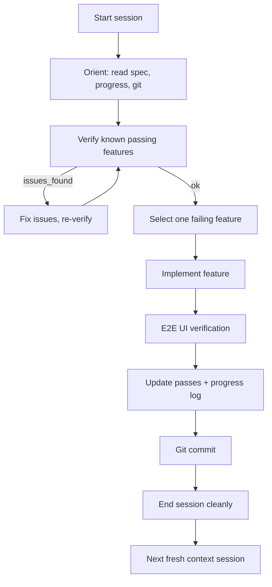

# Long-Running Agent Harness Guide (Language-Agnostic)

This guide distills a long-running agent harness pattern based on Anthropic's
"Effective harnesses for long-running agents" article and the
`autonomous-coding` reference implementation. It is designed to be implemented
in any language or stack.

## 1) Core Idea
Long-running agents operate in discrete sessions with fresh context each time.
The harness must preserve continuity through explicit artifacts and enforce
incremental, verifiable progress. The pattern uses two prompts/roles:
an initializer for environment setup and a coding agent for iterative delivery.

## 2) Required Inputs From the Developer (Checklist)
Provide these inputs before running the harness:
- Project specification document (single source of requirements).
- Working directory with read/write access for the agent.
- Model configuration (API key and model identifier).
- Tool access configuration:
  - File read/write/edit tools in the project directory.
  - Bash/shell tools (restricted by allowlist).
  - Browser automation tools for end-to-end verification.
- Environment startup instructions (to be encoded in `init.sh`).
- Git availability for commit-based state tracking.
- Security policy/allowlist for commands and file access boundaries.

## 3) Fundamental Components
1) **Initializer agent prompt**: sets up the project environment and baseline
   artifacts.
2) **Coding agent prompt**: continues work in subsequent sessions and enforces
   verification and clean handoff.
3) **Feature list** (`feature_list.json`): structured test cases; source of truth.
4) **Progress log** (`claude-progress.txt`): human-readable session summary.
5) **Init script** (`init.sh`): reproducible environment setup and server start.
6) **Git history**: commits as durable checkpoints of verified progress.
7) **Safety model**: sandbox + filesystem scope + command allowlist.
8) **Session orchestrator**: loop that creates fresh context each session and
   resumes until completion.

## 4) Artifact Specifications

### 4.1 Feature List (`feature_list.json`)
Purpose: define all end-to-end requirements and their verification steps. The
coding agent is only allowed to flip `passes` from `false` to `true`.

Example schema:
```json
[
  {
    "category": "functional",
    "description": "New chat button creates a fresh conversation",
    "steps": [
      "Navigate to the main interface",
      "Click the New Chat button",
      "Verify a new conversation is created"
    ],
    "passes": false
  }
]
```

Rules:
- Never remove or edit existing tests.
- Only update the `passes` field after full verification.

### 4.2 Progress Log (`claude-progress.txt`)
Purpose: explain what changed and what should happen next.

Template:
```
Session summary:
- Completed:
  - <feature/test id or description>
- Issues found and fixed:
  - <issue>
- Remaining focus:
  - <next highest-priority feature>
- Progress:
  - <passing>/<total> tests passing
```

### 4.3 Init Script (`init.sh`)
Purpose: reproducible environment setup for new sessions.
Minimum responsibilities:
- Install dependencies.
- Start required services/servers.
- Print access information (URL, ports, credentials if any).

### 4.4 Security Settings
Purpose: defense-in-depth around tool use.
Minimum requirements:
- Sandbox/isolated shell execution.
- Filesystem scope restricted to the project directory.
- Allowlist for commands with extra validation for sensitive commands.

## 5) Roles and Responsibilities

### Initializer Agent (Session 1)
Mandatory tasks:
- Read the project specification.
- Generate `feature_list.json` with exhaustive tests.
- Create `init.sh`.
- Initialize git and commit baseline artifacts.
- Create initial project structure.
- Write `claude-progress.txt` before ending the session.

### Coding Agent (Session 2+)
Mandatory tasks:
- Orient by reading spec, feature list, progress log, and git history.
- Start servers using `init.sh`.
- Run a verification test on already-passing features.
- Select exactly one highest-priority failing feature.
- Implement and verify it end-to-end via UI testing.
- Update only `passes` in `feature_list.json`.
- Commit and update `claude-progress.txt`.

## 6) Session Lifecycle
This is the expected control flow for each coding session:



## 7) Verification and Testing Policy
The harness requires end-to-end UI testing for any feature marked as passing.
Do not mark a feature as passing unless it is verified through user-like UI
interaction (clicks, typing, navigation, screenshots).

## 8) Safety Model (Defense in Depth)
Minimum layers:
- **Sandbox**: isolate shell execution.
- **Filesystem permissions**: limit to project directory.
- **Command allowlist**: explicitly permit safe commands only.
- **Tool scope**: only enable tools required for the task (e.g., browser tools).

## 9) Failure Modes and Mitigations

| Failure mode | Mitigation |
| --- | --- |
| Agent declares victory too early | Use a comprehensive feature list and require selecting a failing test each session. |
| Agent leaves environment buggy | Require verification at session start and commit only after tests pass. |
| Agent marks features complete prematurely | Only flip `passes` after end-to-end verification. |
| Agent cannot run the app | Provide `init.sh` and require reading it each session. |

## 10) Continuity and Resume
Each session is a fresh context. Continuity is maintained by:
- `feature_list.json` as the source of truth.
- `claude-progress.txt` for human-readable status.
- Git commit history for durable checkpoints.
If the run is interrupted, re-run the same harness command to resume.

## 11) Adaptation Notes
The article notes possible future work like specialized agents (testing/QA/cleanup)
to improve outcomes across the SDLC.
[Inference] For non-web domains, replace browser automation with the domain's
end-to-end verification harness (e.g., simulation runs, notebooks, or CLI tests).

## 12) Adoption Checklist
- Create a project specification file.
- Implement initializer and coding prompts as separate roles.
- Add a session orchestrator loop with fresh context per session.
- Generate and enforce a structured feature list.
- Enforce UI-level verification before marking tests as passing.
- Add progress logging and commit checkpoints.
- Configure sandbox + permissions + allowlist.
- Ensure `init.sh` can fully start the environment.

## 13) Do / Don't
Do:
- Work on exactly one feature per session.
- Verify core passing tests before new work.
- Leave the repo clean and committed.

Don't:
- Edit or remove items in the feature list.
- Skip UI-level testing.
- End a session with uncommitted or broken changes.
